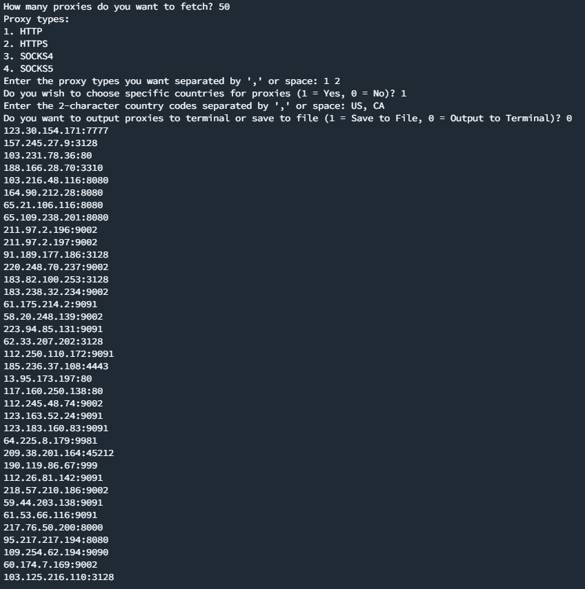

## UHQ - All-in-One Proxy Scraper & Checker
Finds and verifies fresh, high-quality HTTP/HTTPS/SOCKS4/SOCKS5 proxies and saves them to a file or outputs to terminal.

### How to use
1. Run `pip install -r requirements.txt`
2. Run `python main.py`
3. Input how many proxies you want to grab (note that selecting 500+ proxies will take some time as the program ensures each proxy works and has an acceptable response time before saving/outputting it)
4. Select which type(s) of proxy/proxies you want (HTTP, HTTPS, SOCKS4 and/or SOCKS5)
5. Select whether you want to fetch proxies only from specific countries, eg. US, CA, AU (2-character country code)
6. Determine whether to save the proxies to a text file or just output the list to the terminal in real-time as each proxy is verified

### Screenshot

